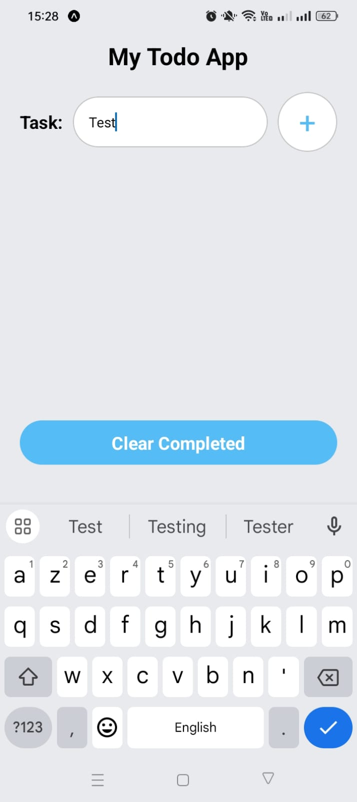
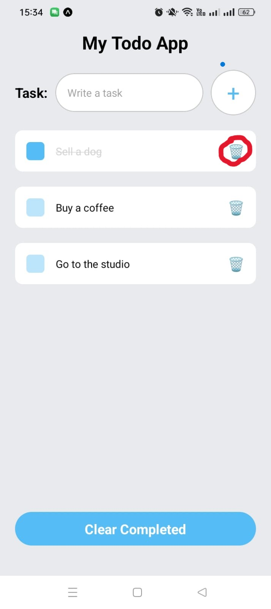
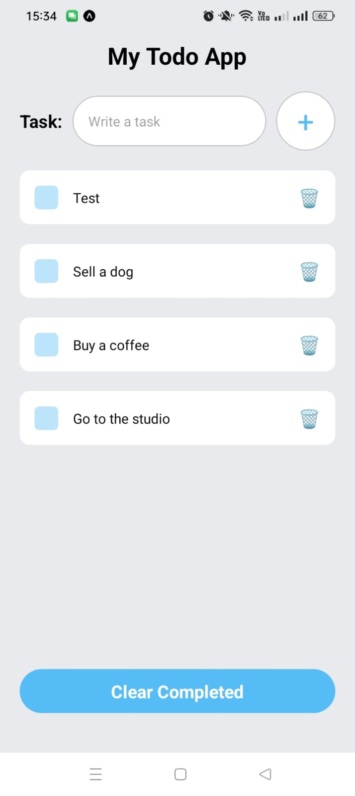
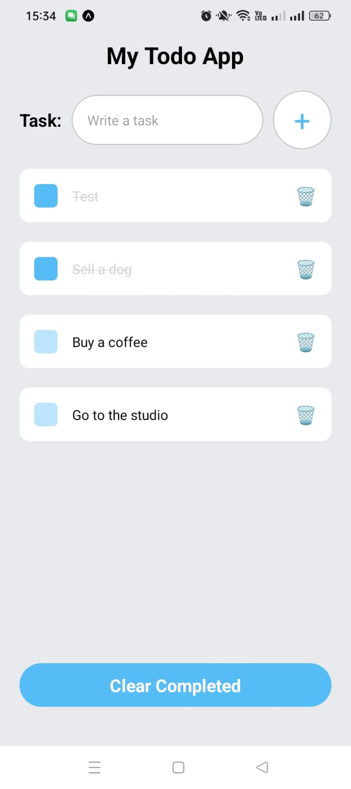

# Todo List App 

A Todo List app built with **React Native**. This app allows users to add, complete, and remove tasks. 

---

## Features 
- Add tasks to your Todo List.
- Mark tasks as completed by tapping on them.
- Remove tasks once completed.

---

## Technologies Used 
- **React Native**: Framework for building native apps.
- **Expo**: For development and testing.
- **JavaScript (ES6+)**: For app logic.
- **React Hooks**: For managing state (`useState`).

---

## Getting Started 

### Prerequisites
Ensure you have the following installed:
- **Node.js** (https://nodejs.org)
- **Expo CLI** (Install via `npm install -g expo-cli`)
- A code editor (**VS Code**)

### Installation
1. Clone the repository:
   ```bash
   git clone https://github.com/elsadaysianturi/TodoList.git

2. Navigate to the project directory
   ```bash
   cd TodoList
3. Install dependencies:
   ```bash
   npm install

#### Running the App 
Using Expo
1. Start the Expo development server:
   ```bash
   npm start
2. Open the Expo Go app on your mobile device (available on Play Store or App Store).
3. Scan the QR code displayed in the terminal or browser to run the app on your device.

#### Running on Emulator
- For Android: Use Android Studio’s emulator.


#### - App Structure 
.
├── App.js               
├── components/
│   └── Task.js          
├── package.json         
├── README.md            
└── node_modules/        

#### - Usage 
1. Launch the app.
2. Type your task in the input field at the bottom.
3. Tap the + button to add the task to the list.
4. Tap on any task to mark it as completed and remove it from the list.

#### - Screenshots
| Feature       | Status      |
|---------------|-------------|
| Add Task      | |
| Delete Task   | |
|Task List      | |
|Completed task | |


